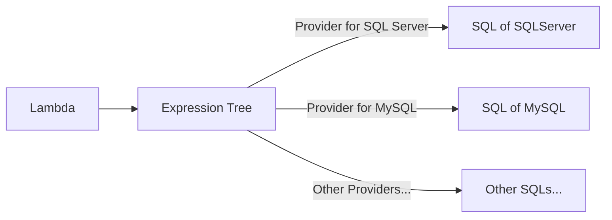
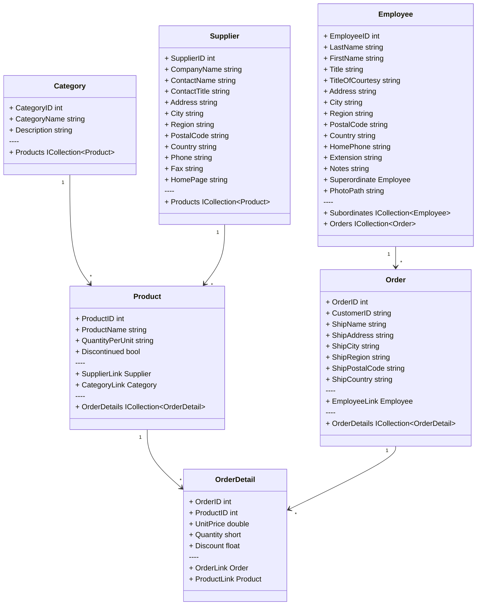

### 探索 LinqSharp

探索 **LinqSharp** 前提是能够清楚地了解它所生成的 **SQL** 语句。

<br/>

#### 表达式树

**表达式树** 使 **C#** 成为了真正强大的语言。

我们可以通过 **LINQ** API 轻松地将 **Lambda** 转换为 **表达式树**，同时 **ORM** 允许我们将 **表达式树** 转换为我们想要的任何形式。



多数语言没有提供 **Lambda** 到 树表达式 编译时转换，因为它还需要真实泛型地支持。

这也是为什么 **.NET ORM** 能够被设计得非常好用的原因之一。

<br/>

#### 输出 SQL

如果您没有可用的测试用数据库，不妨试试 **Northwnd**。

通过这个简单的销售网络数据库，我们将向您介绍如何使用 **LinqSharp**。



1. 创建 控制台应用程序（ **.NET 7** ）.

2. 执行以下命令安装 **Northwnd**:

    ```powershel
    dotnet add package Microsoft.EntityFrameworkCore --version 7.0.0
    dotnet add package Microsoft.EntityFrameworkCore.Design --version 7.0.0
    dotnet add package Microsoft.EntityFrameworkCore.Sqlite --version 7.0.0
    dotnet add package LinqSharp --version 7.0
    dotnet add package Northwnd --version 7.0
    dotnet add package Ink --version 0.12.1
    ```

3. 随后，您需要添加 `NorthwndFactory.cs` 文件到工程根目录：

    ```csharp filename="NorthwndFactory.cs"
    public class NorthwndFactory : IDesignTimeDbContextFactory<NorthwndContext>
    {
        private static readonly string _connectionString = "Data Source=northwnd.db";
    
        public NorthwndContext CreateDbContext(params string[] args)
        {
            var assemblyName = Assembly.GetExecutingAssembly().GetName().Name;
            var options = new DbContextOptionsBuilder()
                .UseSqlite(_connectionString, x => x.MigrationsAssembly(assemblyName))
                .Options;
            return new NorthwndContext(options);
        }
    }
    ```

4. 打开终端，执行以下脚本来生成迁移，并应用到数据库：

    ```powershell
    dotnet ef migrations add InitNorthwnd
    ```

5. 编辑 `Program.cs`：

    ```csharp filename="Program.cs"
    static void Main(string[] args)
    {
        var factory = new NorthwndFactory();
        using var context = factory.CreateDbContext();
    
        if (!context.Database.GetAppliedMigrations().Any())
        {
            context.Database.Migrate();
            context.InitializeNorthwnd(new NorthwndMemoryContext());
        }
    
        var query = (
            from c in context.Categories
            select new
            {
                c.CategoryID,
                c.CategoryName,
            }
        );
        var sql = query.ToQueryString();
    
        Echo.Line(sql)
            .Table(query);
    }
    ```

6. 编译后运行应用程序，如果一切正常，您将得到如下结果：

    ```sql
    SELECT "c"."CategoryID", "c"."CategoryName"
    FROM "Categories" AS "c"
    ```
    ```markdown
    +------------+----------------+
    | CategoryID | CategoryName   |
    +------------+----------------+
    | 1          | Beverages      |
    | 2          | Condiments     |
    | 3          | Confections    |
    | 4          | Dairy Products |
    | 5          | Grains/Cereals |
    | 6          | Meat/Poultry   |
    | 7          | Produce        |
    | 8          | Seafood        |
    +------------+----------------+
    ```

<br/>


