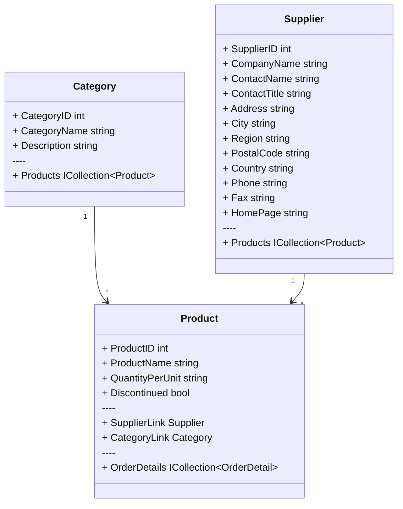

import Alert from '../../components/alert'

# 版本计划：搜索更新

<Alert type="note">
计划于 2023 年 12 月 31 日前更新。
</Alert>

### 原搜索语法

案例：查询 **分类名称**、分类下的 **产品名称**、产品下的 **供应商公司名称** 包含 指定字符串。

表模型：



原调用语法：

```csharp copy {5-6}
/* Old code */
from c in Categories.Search("a", c => new
{
    c.CategoryName,
    _0 = c.Products.Select(x => x.ProductName),
    _1 = c.Products.Select(x => x.SupplierLink.CompanyName),
})
select new
{
    c.CategoryName,
}
```

原设计方案有如下缺点：

- **New Expression** 要求每个属性必须使用名称（或隐式名称）。例如，**\_0** 和 **\_1**。
- 每条规则返回值必须是 **最小变量** 或者 **数组**，不支持 **new 表达式**，导致生成的 **SQL** 有一定程度的冗余。

下面是生成的 **SQL** 调用，由于每条规则是独立处理，因此会生成多个 **EXISTS** 部分，然后使用 **OR** 连接。

```sql {6-7,9-11}
/* Generated SQL */
SELECT `@`.`CategoryName`
FROM `@n.Categories` AS `@`
WHERE ((`@`.`CategoryName` LIKE '%a%') OR EXISTS (
    SELECT 1
    FROM `@n.Products` AS `@0`
    WHERE (`@`.`CategoryID` = `@0`.`CategoryID`) AND (`@0`.`ProductName` LIKE '%a%'))) OR EXISTS (
    SELECT 1
    FROM `@n.Products` AS `@1`
    LEFT JOIN `@n.Suppliers` AS `@2` ON `@1`.`SupplierID` = `@2`.`SupplierID`
    WHERE (`@`.`CategoryID` = `@1`.`CategoryID`) AND (`@2`.`CompanyName` IS NOT NULL AND (`@2`.`CompanyName` LIKE '%a%')))
```

<br/>

### 重新设计

为了优化以上问题，我们决定：

- 使用 **Initializers 语法** 代替 **New Expression 语法** 重新设计该功能。
- 规则返回值允许使用 **New Expression** 来优化代码调用，同时也能够生成更合理的 **SQL** 调用。

使用 **LINQ** 调用，我们可以使用 **let** 语句来定义查询链，以更容易的方式来编写代码：

```csharp copy {6-12}
/* LINQ code */
from c in Categories.Search("a", c => new SearchSelector
{
    c.CategoryName,
    
    from p in c.Products
    let s = p.SupplierLink
    select new
    {
        p.ProductName,
        s.CompanyName,
    },
})
select new
{
    c.CategoryName,
}
```

同义的 **Lambda** 调用：

```csharp copy {6-10}
/* Lambda code */
from c in Categories.Search("a", c => new SearchSelector
{
    c.CategoryName,
    
    c.Products.Select(p => new
    {
        p.ProductName,
        p.SupplierLink.CompanyName,
    })
})
select new
{
    c.CategoryName,
}
```

生成的 **SQL** 调用：

```sql {6-8}
/* Generated SQL */
SELECT `@`.`CategoryName`
FROM `@n.Categories` AS `@`
WHERE (`@`.`CategoryName` LIKE '%a%') OR EXISTS (
    SELECT 1
    FROM `@n.Products` AS `@0`
    LEFT JOIN `@n.Suppliers` AS `@1` ON `@0`.`SupplierID` = `@1`.`SupplierID`
    WHERE (`@`.`CategoryID` = `@0`.`CategoryID`) AND ((`@0`.`ProductName` LIKE '%a%') OR (`@1`.`CompanyName` LIKE '%a%')))
```

<br/>

### 最佳实践

如果能够使用 **单个规则**，那么就不使用 **多条规则**。

例如，在上述案例中，如果使用 **多条规则** 实现：

```csharp copy {4-5}
/* LINQ code */
from c in Categories.Search("a", c => new SearchSelector
{
    from p in c.Products select p.ProductName,				
    from p in c.Products select p.SupplierLink.CompanyName,
})
select new
{
    c.CategoryName,
}
```

那么，生成的 **SQL** 调用就会变为：

```sql {5-6,8-10}
SELECT `@`.`CategoryName`
FROM `@n.Categories` AS `@`
WHERE EXISTS (
    SELECT 1
    FROM `@n.Products` AS `@0`
    WHERE (`@`.`CategoryID` = `@0`.`CategoryID`) AND (`@0`.`ProductName` LIKE '%a%')) OR EXISTS (
    SELECT 1
    FROM `@n.Products` AS `@1`
    LEFT JOIN `@n.Suppliers` AS `@2` ON `@1`.`SupplierID` = `@2`.`SupplierID`
    WHERE (`@`.`CategoryID` = `@1`.`CategoryID`) AND (`@2`.`CompanyName` LIKE '%a%'))
```

推荐使用：

```csharp copy {4-8}
/* LINQ code */
from c in Categories.Search("a", c => new SearchSelector
{
    from p in c.Products select new
    {
        p.ProductName,
        p.SupplierLink.CompanyName,
    },
})
select new
{
    c.CategoryName,
}
```

<br/>

### 开发计划

已实现的部分：

- [x] 基础解析
- [x] 字符串匹配：或者。

我们还需实现以下内容：

- [ ] 为查询链提供 **多字符串搜索**。
- [ ] 更多的 单字符串匹配模式：**包含** | **全等**。
- [ ] 更多的 多字符串匹配模式：**或者** | **并且**。

<br/>

```csharp {2}
/* LINQ code */
from c in Categories.Search("a", c => new SearchSelector(SearchMode.Contains)
{
    from p in c.Products select new
    {
        p.ProductName,
        p.SupplierLink.CompanyName,
    },
})
select new
{
    c.CategoryName,
}
```


<br/>

有更多想法？

👉 [New Issue · zmjack/LinqSharp (github.com)](https://github.com/zmjack/linqsharp/issues/new?labels=feedback)