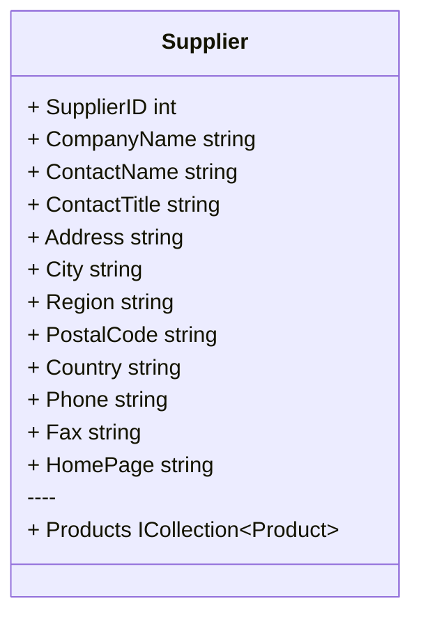
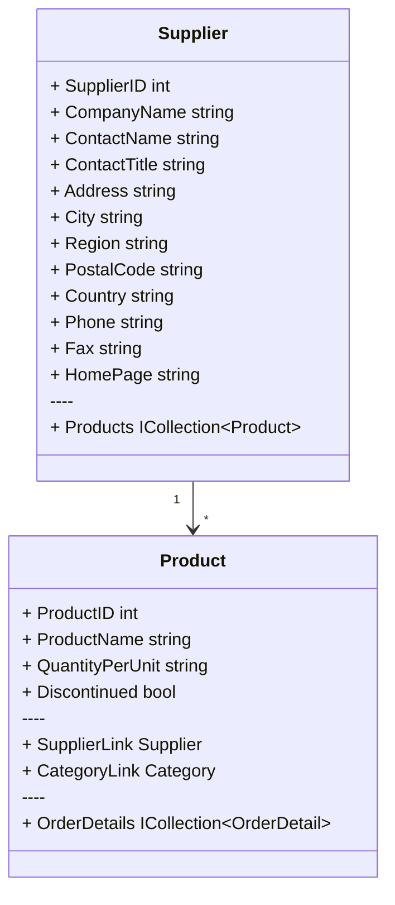

import { useRef } from "react"
import Alert from '../../components/alert'

### 内容搜索

**Search extension** 为在整个数据库中搜索指定值提供了支持。

<Alert type="lightbulb">
我们正在改写调用语法，该文档可能过期。
</Alert>

在示例数据库中，**Suppliers** 结构如下：



现在，我们查询在 **Suppliers** 表中，**`ContactName`** 或者 **`CompanyName`** 列中包含 `ch` 的记录：

```csharp
var query = (
    from s in context.Suppliers.Search("ch", s => new
    {
        s.ContactName,
        s.CompanyName,
    })
    select new
    {
        s.SupplierID,
        s.ContactName,
        s.CompanyName,
    }
);

Echo.Line(query.ToQueryString())
    .Table(query);
```

运行结果：

```sql
SELECT "s"."SupplierID", "s"."ContactName", "s"."CompanyName"
FROM "Suppliers" AS "s"
WHERE 
(
    ("s"."ContactName" IS NOT NULL)
    AND ('ch' = '' OR instr("s"."ContactName", 'ch') > 0)
) 
OR 'ch' = '' OR instr("s"."CompanyName", 'ch') > 0
```

```markdown
+------------+---------------+----------------------------------------+
| SupplierID | ContactName   | CompanyName                            |
+------------+---------------+----------------------------------------+
| 13         | Sven Petersen | Nord-Ost-Fisch Handelsgesellschaft mbH |
| 17         | Michael Bj?rn | Svensk Sj?f?da AB                      |
| 19         | Robb Merchant | New England Seafood Cannery            |
| 22         | Dirk Luchte   | Zaanse Snoepfabriek                    |
+------------+---------------+----------------------------------------+
```

<br/>

事情开始变得有趣了。

如果要在相关表中查找，只需要稍加修改即可。

例如，我们查询在 **Suppliers** 表中，**`CompanyName`** 列以及它的关联表 **Products** 的 **`ProductName`** 中包含 `ch` 的记录：



```csharp
var query = (
    from s in context.Suppliers.Search("ch", s => new
    {
        s.CompanyName,
        _ = from p in s.Products select p.ProductName,
    })
    select new
    {
        s.SupplierID,
        s.CompanyName,
        Products = string.Join(",",
            from p in s.Products
            select p.ProductName
        ),
    }
);

Echo.Line(query.ToQueryString())
    .Table(query);
```

```sql
SELECT "s"."SupplierID", "s"."CompanyName", "p0"."ProductName", "p0"."ProductID"
FROM "Suppliers" AS "s"
LEFT JOIN "Products" AS "p0" ON "s"."SupplierID" = "p0"."SupplierID"
WHERE 'ch' = '' OR instr("s"."CompanyName", 'ch') > 0 OR EXISTS (
    SELECT 1
    FROM "Products" AS "p"
    WHERE "s"."SupplierID" = "p"."SupplierID" AND ('ch' = '' OR instr("p"."ProductName", 'ch') > 0))
ORDER BY "s"."SupplierID"
```

```markdown
+------------+----------------------------------------+----------------------------------------------------------------+
| SupplierID | CompanyName                            | Products                                                       |
+------------+----------------------------------------+----------------------------------------------------------------+
| 5          | Cooperativa de Quesos 'Las Cabras'     | Queso Cabrales,Queso Manchego La Pastora                       |
| 11         | Heli Sü?waren GmbH & Co. KG            | NuNuCa Nu?-Nougat-Creme,Gumb?r Gummib?rchen,Schoggi Schokolade |
| 13         | Nord-Ost-Fisch Handelsgesellschaft mbH | Nord-Ost Matjeshering                                          |
| 16         | Bigfoot Breweries                      | Sasquatch Ale,Steeleye Stout,Laughing Lumberjack Lager         |
| 25         | Ma Maison                              | Tourtière,Paté chinois                                         |
| 26         | Pasta Buttini s.r.l.                   | Gnocchi di nonna Alice,Ravioli Angelo                          |
+------------+----------------------------------------+----------------------------------------------------------------+
```

<br/>

**Search** 扩展提供了以下搜索选项：

|      | 选项            | 描述                                     |
| ---- | --------------- | ---------------------------------------- |
| 默认 | **Contains**    | 任何指定字段 **包含** 搜索字符串。       |
|      | **NotContains** | 所有指定字段中都 **不包含** 搜索字符串。 |
|      | **Equals**      | 任何指定字段 **等于** 搜索字符串。       |
|      | **NotEquals**   | 所有指定字段中都 **不等于** 搜索字符串。 |

